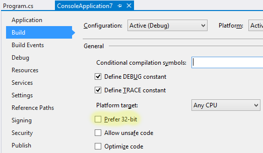
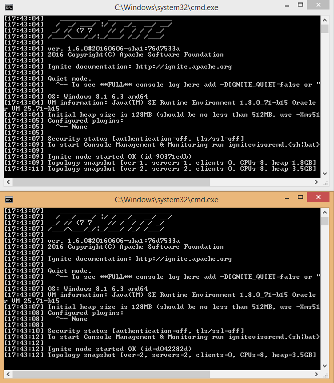

This post opens a blog series about [Apache Ignite.NET](https://apacheignite-net.readme.io/), distributed in-memory platform.


We are going to start from the basics, and work our way up to implement a simple fully-functional social network site in a distributed and automatically scalable fashion.

## What exactly is Apache Ignite?

[Ignite](https://ignite.apache.org) is a framework for building distributed applications that run on multiple machines, share data and computing power. 
Properly built distributed applications can be scaled out easily.

Our first step is to start a cluster locally and see how Ignite nodes connect to each other.

## Terminology
* Ignite Node: An instance produced by one of the ```Ignition.Start*``` methods. There can be multiple nodes per machine or even per process. 
* Cluster, Topology: A set of interconnected nodes. There can be multiple separate clusters on the same machine, or even in the same procesee.
* Server: Ignite Node running in server mode (default mode)
* Client: Ignite Node running in client mode (```IgniteConfiguration.ClientMode = true```)

## Prerequisites
We are going to need [Visual Studio](https://www.visualstudio.com/) (2010+ will do) and [Java](https://java.com/en/download/). 

Yes, Java. Ignite.NET is built on top of Ignite, which needs JRE to run. Don't worry, we are not going to deal with it in any way directly, it is just needed at runtime.   

## First Ignite.NET application
Let's get to the coding. Open up Visual Studio and create a new Console Application (.NET 4+). We are going to use console a lot during our first steps to better observe how the clustering works.
Make sure to disable "Prefer 32-bit" option in the project settings so that your app runs in x64 mode on x64 OS and works with installed JRE:

 

Next, install the Ignite NuGet package. In the Package Manager Console: 

```
Install-Package Apache.Ignite
```

Import `Apache.Ignite.Core` namespace, add `Ignition.Start()` to the Main method, and our distributed application is done!

```cs
using System;
using Apache.Ignite.Core;

class Program
{
    static void Main(string[] args)
    {
        Ignition.Start();
        Console.ReadKey(); // keep the node running
    }
}
```

Start the program and observe the console output. In particular, we are interested in the following line:

```
[17:35:33] Topology snapshot [ver=1, servers=1, clients=0, CPUs=8, heap=1.8GB]
```
We can see that there is one server node in the cluster. 

Do not close the running app and start it once again (use Ctrl-F5 in Visual Studio to run without a debugger). You should see how two applications connect to each other:

```
[17:41:35] Topology snapshot [ver=2, servers=2, clients=0, CPUs=8, heap=3.5GB]
```



Close one of the nodes. In a moment, remaining node will detect that another one has disconnected, and report another toplogy change:

```
[17:44:12] Topology snapshot [ver=3, servers=1, clients=0, CPUs=8, heap=1.8GB]
``` 

You can start as many nodes as you want, locally or on multiple machines within the same network (don't forget about firewalls though).

---
[Next time: working with distributed cache.](https://ptupitsyn.github.io/Getting-Started-With-Apache-Ignite-Net-2-Cache/)   