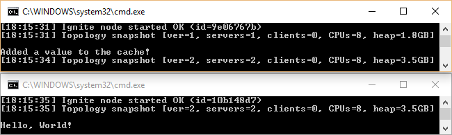

This part covers basic cache operations and user object serialization.

* [Part 1: Getting Started](https://ptupitsyn.github.io/Getting-Started-With-Apache-Ignite-Net/)
* Part 2: Distributed Cache  

## What is Ignite Cache
You can think of Ignite cache as `ConcurrentDictionary<K, V>` where entries are distributed across multiple machines, and all cache entries can be accessed by any given node at any moment.  

* In `Partitioned` cache mode, each Ignite node stores only a part of all cache entries. Adding more nodes increases total memory for cache entries.
* In `Replicated` cache mode, each node holds a copy of all cache entries. 

All cache operations guarantee thread safety and cluster-wide atomicity.

## Basic cache operations
Ignite cache is represented by `ICache<K, V>` interface. There can be any number of caches per cluster. Caches are identified by a cluster-wide `string` name.
Use `IIgnite.CreateCache`, `GetOrCreateCache` and `GetCache` methods to create and retrieve cache instances by name.

`Put` and `Get` methods provide a basic way to write and read the data from cache:

```cs
IIgnite ignite = Ignition.Start();	
ICache<int, string> cache = ignite.GetOrCreateCache<int, string>("test");
cache.Put(1, "Hello, World!");
Console.WriteLine(cache.Get(1));
```

## Multi-node demo
To demonstrate cache atomicity and sharing data between nodes, let's implement a scenario where one node adds data, and another one reads it.
To make sure that only one node writes to cache, we can use `ICache.PutIfAbsent` method which guarantees that the cache entry will be created only once.

Put the following code inside the Main method and run the app twice (or more times):

```cs
IIgnite ignite = Ignition.Start();
ICache<int, string> cache = ignite.GetOrCreateCache<int, string>("test");
if (cache.PutIfAbsent(1, "Hello, World!"))
	Console.WriteLine("Added a value to the cache!")
else
	Console.WriteLine(cache.Get(1));
``` 


## Complex objects
Since Ignite cache is distributed, we need a way to serialize cache data to send it over the wire to remote nodes. Simple data types (all primitive types, strings, Guids, and arrays of these) are supported by default. 
For any other type, Ignite supports two serialization mechanisms:

* .NET Binary Serialization: mark your class with `[Serializable]` attribute. 
Pros: simple; no need to register the class before node start. 
Cons: performance; SQL won't work; class modification is required.
* Ignite Binary Serialization. Pros: compact and fast; enables SQL queries; does not require class modification. Cons: requires type registration.

The following code demonstates how to work with a user-defined class and Ignite serialization:

```cs
static void Main()
{
    var cfg = new IgniteConfiguration
    {
        // Register custom class for Ignite serialization
        BinaryConfiguration = new BinaryConfiguration(typeof(Person))
    };
    IIgnite ignite = Ignition.Start(cfg);

    ICache<int, Person> cache = ignite.GetOrCreateCache<int, Person>("persons");
    cache[1] = new Person {Name = "John Doe", Age = 27};

    foreach (ICacheEntry<int, Person> cacheEntry in cache)
        Console.WriteLine(cacheEntry);
}

class Person
{
    public string Name { get; set; }
    public int Age { get; set; }

    public override string ToString()
    {
        return $"Person [Name={Name}, Age={Age}]";
    }
}
```
And the output is:

```
CacheEntry [Key=1, Value=Person [Name=John Doe, Age=27]]
```

## Binary Mode
Another advantage of Ignite binary serialization is the ability to work with cache data in a non-deserialized mode. 
Extend the example above with the following code:

```cs
var binCache = cache.WithKeepBinary<int, IBinaryObject>();
IBinaryObject binPerson = binCache[1];
Console.WriteLine(binPerson.GetField<string>("Name"));
```
Here we retrieve a Person object in binary form, and deserialize a single Name field.

Binary mode can be used:

* To improve performance (when only some fields are needed)
* When the class is not available on the node and deserialization is not possible
* For cross-platform interoperation (put an object in Java, read in .NET)  


---
Next time: query cache data with SQL and LINQ.