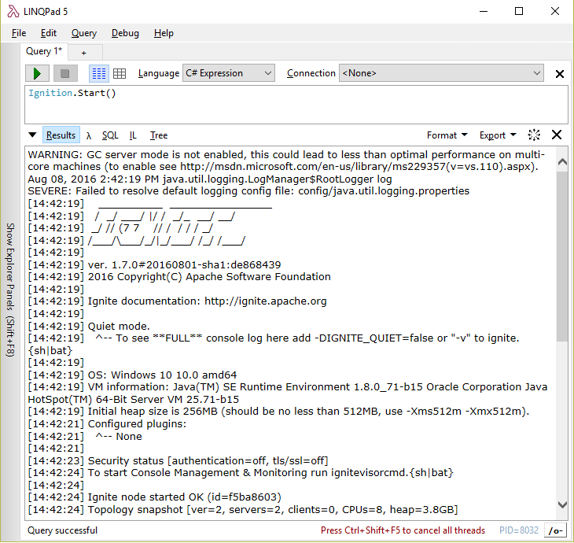

Apache Ignite 1.7 [has been released](https://ignite.apache.org/news.html#release-1.7.0) last week. Let's see what is new in the .NET part.


## Distributed Joins
This is a big one! Previously, SQL joins worked only for colocated data: if cache entry for `John`, who works for `Apache`, is located on node 1, but cache entry for `Apache` is located on node 2, SQL join won't return this pair.

Now, however, this is no longer the issue. Joins work as expected in any scenario.
This feature is not enabled by default, you have to set `SqlQuery.EnableDistributedJoins` or `SqlFieldsQuery.EnableDistributedJoins` to `true` explicitly.

As for LINQ, there is a new overload:

```cs
public static IQueryable<ICacheEntry<K, V>>
    AsCacheQueryable<K, V>(this ICache<K, V> cache, QueryOptions queryOptions)
```

Where `QueryOptions` class has `EnableDistributedJoins` property.

## User-defined AffinityFunction

In addition to predefined `FairAffinityFunction` and `RendezvousAffinityFunction`, it is now possible to create a custom one by implementing `IAffinityFunction` interface or inheriting one of the predefined classes.

## .NET configuration in Apache.Ignite.exe

Apache.Ignite.exe standalone node runner got two new command-line arguments: `ConfigFileName` and `ConfigSectionName`. These can be used to load `IgniteConfigurationSection` either from Apache.Ignite.exe.config, or from any other config file.
See [Getting Started](https://apacheignite-net.readme.io/docs/getting-started-2#section-using-app-config).

## Forward Java output to the .NET console

Ignite writes useful information to console: topology snapshots, metrics, errors and warnings, etc. This information is also written to the log, but console may be more handy during development.

Most of this information is written from underlying Java code. This is fine when you run a console application. However, this does not work with tools that intercept .NET console: unit test runners (Visual Studio and ReSharper), LINQPad, etc.

Ignite 1.7 has this fixed. All console output is now written using native .NET mechanism, and you can expect any tooling to work properly. Below is a screenshot of Ignite running in LINQPad.


## Java exception information in InnerException

Another debugging-related improvement is inclusion of underlying Java exception details in IgniteException.InnerException (where applicable).

In 1.6, when exception occured on Java side of things, all you got in .NET was some basic exception type mapping, and the exception message text.
This was often not enough to understand the problem.
For example, if you attempt to start Ignite with invalid configuration, exception message will have some vague `Failed to start manager: GridManagerAdapter` text. All the details are buried down the stack trace:

```cs
Ignition.Start(new IgniteConfiguration
{
    CommunicationSpi = new TcpCommunicationSpi
    {
        // Negative timeout is not valid
        IdleConnectionTimeout = TimeSpan.MinValue
    }
});
```

```text
Apache.Ignite.Core.Common.IgniteException: Failed to start manager: GridManagerAdapter [enabled=true, name=org.apache.ignite.internal.managers.communication.GridIoManager] ---> Apache.Ignite.Core.Common.JavaException: class org.apache.ignite.IgniteException: Failed to start manager: GridManagerAdapter [enabled=true, name=org.apache.ignite.internal.managers.communication.GridIoManager]
  at org.apache.ignite.internal.util.IgniteUtils.convertException(IgniteUtils.java:908)
  at org.apache.ignite.internal.processors.platform.PlatformAbstractBootstrap.start(PlatformAbstractBootstrap.java:48)
  at org.apache.ignite.internal.processors.platform.PlatformIgnition.start(PlatformIgnition.java:76)
Caused by: class org.apache.ignite.IgniteCheckedException: Failed to start manager: GridManagerAdapter [enabled=true, name=org.apache.ignite.internal.managers.communication.GridIoManager]
  at org.apache.ignite.internal.IgniteKernal.startManager(IgniteKernal.java:1576)
  at org.apache.ignite.internal.IgniteKernal.start(IgniteKernal.java:846)
  at org.apache.ignite.internal.IgnitionEx$IgniteNamedInstance.start0(IgnitionEx.java:1739)
  at org.apache.ignite.internal.IgnitionEx$IgniteNamedInstance.start(IgnitionEx.java:1589)
  at org.apache.ignite.internal.IgnitionEx.start0(IgnitionEx.java:1042)
  at org.apache.ignite.internal.IgnitionEx.start(IgnitionEx.java:549)
  at org.apache.ignite.internal.processors.platform.PlatformAbstractBootstrap.start(PlatformAbstractBootstrap.java:43)
  ... 1 more
Caused by: class org.apache.ignite.IgniteCheckedException: Failed to get SPI attributes.
  at org.apache.ignite.internal.managers.GridManagerAdapter.startSpi(GridManagerAdapter.java:248)
  at org.apache.ignite.internal.managers.communication.GridIoManager.start(GridIoManager.java:258)
  at org.apache.ignite.internal.IgniteKernal.startManager(IgniteKernal.java:1571)
  ... 7 more
Caused by: class org.apache.ignite.spi.IgniteSpiException: SPI parameter failed condition check: idleConnTimeout > 0
  at org.apache.ignite.spi.IgniteSpiAdapter.assertParameter(IgniteSpiAdapter.java:344)
  at org.apache.ignite.spi.communication.tcp.TcpCommunicationSpi.getNodeAttributes(TcpCommunicationSpi.java:1419)
  at org.apache.ignite.internal.managers.GridManagerAdapter.startSpi(GridManagerAdapter.java:231)
  ... 9 more
```

With the full stack trace, we can tell what is wrong: `idleConnTimeout > 0` check failed.

## Configuration schema NuGet package

## ASP.NET Output Cache provider