Ignite cluster can consist of nodes on any supported platform: Java, .NET and C++. Let's see how to run .NET/Java cluster with NuGet and Maven.

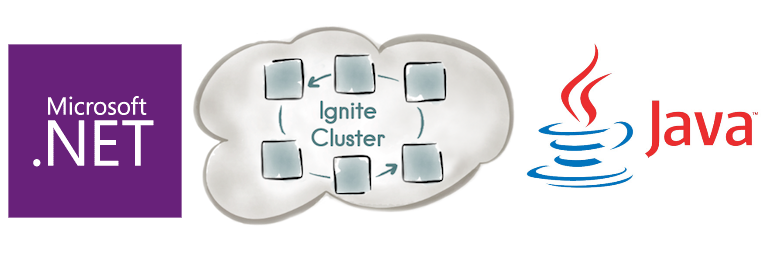

# Prerequisites

This post is both for .NET developers who may be new to Java and vice versa, so I'll provide very detailed steps.

We are going to use the following software:

* Visual Studio 2015 (includes NuGet; free Community edition)
* IntelliJ IDEA (includes Maven; free Community edition)

Complete source code for this post is available on GitHub: [github.com/ptupitsyn/ignite-multi-platform-demo](https://github.com/ptupitsyn/ignite-multi-platform-demo)

# Goals

* Connect Java and .NET node
* Share data through Ignite cache using Java and .NET classes with the same name and fields
* Run continuous query to see real-time updates from another platform

# Setting Up Java Project

* Run IntelliJ IDEA and click "Create New Project":

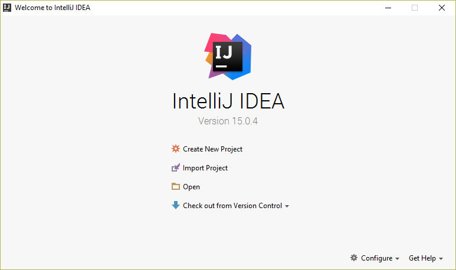

* Select Maven and click "Next":

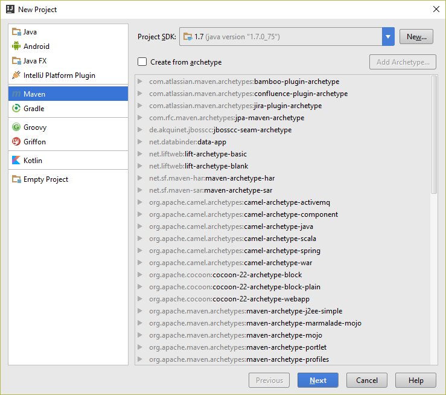

* Enter Maven info, click "Next" and "Finish":

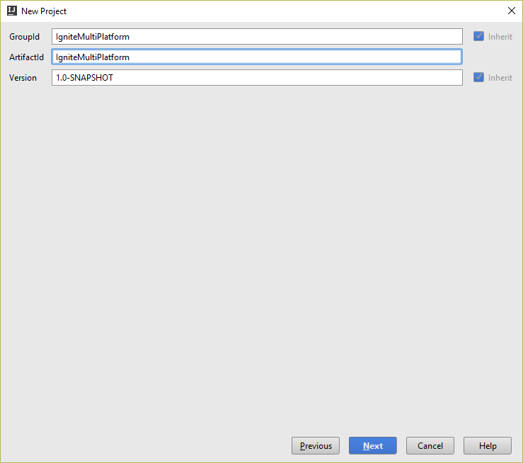
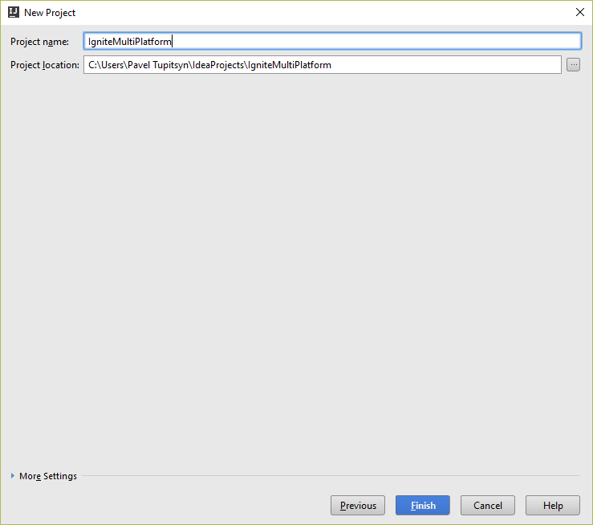

* As a result, you should see the `pom.xml` file of the new project open:

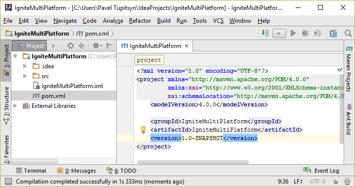

* Add Ignite dependency to the `<project>` section:

```xml
<dependencies>
    <dependency>
        <groupId>org.apache.ignite</groupId>
        <artifactId>ignite-core</artifactId>
        <version>1.7.0</version>
    </dependency>
</dependencies>
```

* IDEA may ask you to import project changes, click any of the links:

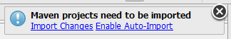

* Add `Demo` class to src\main\java with the following code:

```java
import org.apache.ignite.Ignition;

public class Demo {
    public static void main(String[] args) {
        Ignition.start();
    }
}
```

* Run it with `Shift+F10` and verify that node starts in IDEA console:

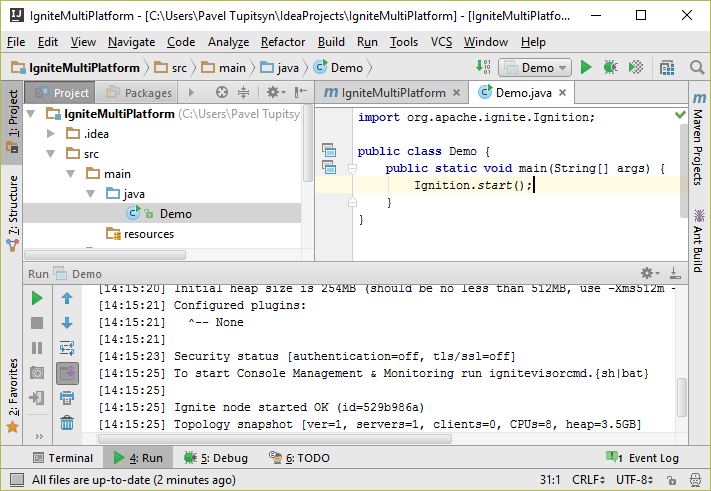

* Stop the program with `Ctrl+F2` or the stop button.

# Setting Up .NET Project

* Run Visual Studio and click File -> New -> Project
* Select Visual C# -> Windows -> Console Application
* Make sure to have .NET Framework of version 4+ selected on top

 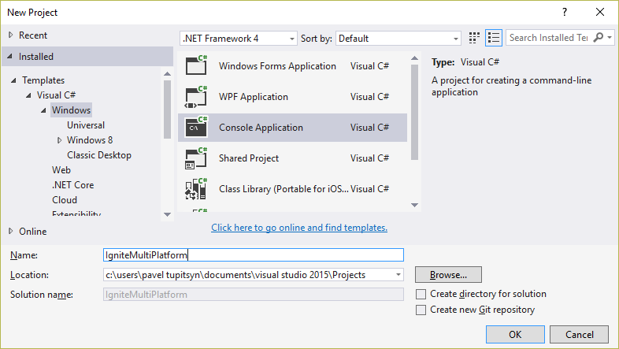

* Click "OK", and you will be presented with an empty console project
* Bring up NuGet console: Menu -> Tools -> NuGet Package Manager -> Package Manager Console
* Type `Install-Package Apache.Ignite`

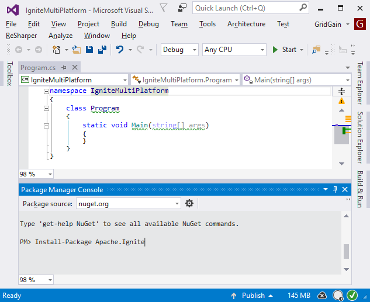

* Hit Enter and there should be a `Successfully installed 'Apache.Ignite 1.7.0' to IgniteMultiPlatform` message.
* Replace `Program.cs` contents with the following code:

```cs
using System;
using Apache.Ignite.Core;

class Program
{
    static void Main(string[] args)
    {
        Ignition.Start();
        Console.ReadKey();
    }
}
```

* Run the program with `Ctrl-F5` and verify that it starts Ignite in console:

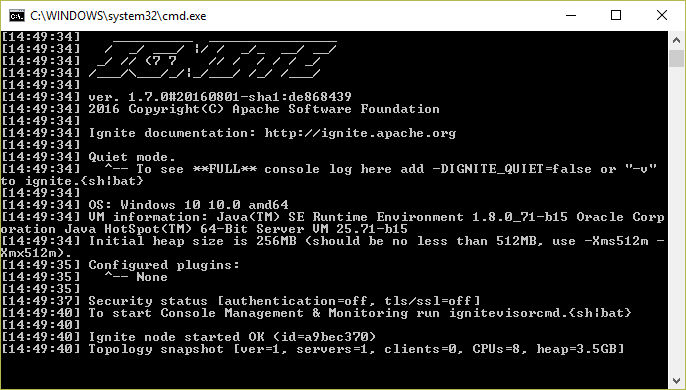

# Tweak Java Node Configuration To Understand .NET Node

Now if you run both Java node in IDEA and .NET node in Visual Studio, you will get the following error in one of them:

```text
IgniteSpiException: Local node's binary configuration is not equal to remote node's binary configuration [locBinaryCfg={globSerializer=null, compactFooter=true, globIdMapper=org.apache.ignite.binary.BinaryBasicIdMapper}, rmtBinaryCfg=null]
```

The problem here is that .NET nodes only support `BinaryBasicIdMapper` and `BinaryBasicNameMapper` in `BinaryConfiguration`, and we should set them explicitly in Java.
Replace `Ignition.start();` line with the following code:

```java
BinaryConfiguration binCfg = new BinaryConfiguration();

binCfg.setIdMapper(new BinaryBasicIdMapper());
binCfg.setNameMapper(new BinaryBasicNameMapper());

IgniteConfiguration cfg = new IgniteConfiguration().setBinaryConfiguration(binCfg);

Ignition.start(cfg);
```

Run both .NET and Java nodes and verify that they join each other:

```text
[15:04:17] Topology snapshot [ver=2, servers=2, clients=0, CPUs=8, heap=7.1GB]
```

# Exchange Data Through Ignite Cache

Now that we have our nodes connected, let's write a simple chat on both platforms to demonstrate data exchange.
The code will be very similar, since API is the same, and language syntax is close.

First, let's define classes with identical names and members.

## Java Message Class

Right-click on src\main\java project folder and select New -> Java Class, enter `Message` name. Replace the code with this:

```java
public class Message {
    public Message(String author, String text) {
        this.author = author;
        this.text = text;
    }

    final String author;
    final String text;
}
```

## .NET Message Class

Right-click project node in Solution Explorer and select Add -> Class..., enter `Message` name. Replace the code with this:

```cs
class Message
{
    public Message(string author, string text)
    {
        Author = author;
        Text = text;
    }

    public string Author { get; }
    public string Text { get; }
}
```

`Basic` mappers are case-insensitive and ignore namespaces (packages),
therefore these two classes will map to each other: we can put Message instance to cache on one platform and get on another.

Now let's write the chat itself. The logic is simple: user enters a chat message, we put it into the cache.
[Continuous Query](http://apacheignite.gridgain.org/docs/continuous-queries) receives all cache update notifications and displays them.

## Java Chat

Update our `main` method with the following:

```java
// Retrieve user name
System.out.print("Hi, enter your name: ");
Scanner consoleScanner = new Scanner(System.in);
String name = consoleScanner.nextLine();

// Get or create cache
IgniteCache<Long, Message> cache = ignite.getOrCreateCache("chat");

// Initialize unique ID sequence
IgniteAtomicSequence messageId = ignite.atomicSequence("chatId", 0, true);

// Set up continuous query
ContinuousQuery<Long, Message> qry = new ContinuousQuery<>();

qry.setLocalListener(iterable -> {
    // This will be invoked immediately on each cache update
    for (CacheEntryEvent<? extends Long, ? extends Message> evt : iterable)
        System.out.println(evt.getValue().author + ": " + evt.getValue().text);
});

cache.query(qry);

// Run the chat loop
while (true) {
    System.out.print("> ");

    String msgText = consoleScanner.nextLine();
    Long msgId = messageId.incrementAndGet();

    cache.put(msgId, new Message(name, msgText));
}
```

## .NET Chat

There are two differences in Ignite.NET (these features are expected in the next release):

* We have to register a type in BinaryConfiguration to use it in cache (Java does this automatically)
* Lambda expressions are not supported in the API and we have to implement `ICacheEntryEventListener<K, V>` interface separately

Therefore, create a new class with the following code:

```cs
using System;
using System.Collections.Generic;
using Apache.Ignite.Core.Cache.Event;

class CacheListener : ICacheEntryEventListener<long, Message>
{
    public void OnEvent(IEnumerable<ICacheEntryEvent<long, Message>> evts)
    {
        foreach (var evt in evts)
            Console.WriteLine($"{evt.Value.Author}: {evt.Value.Text}");
    }
}```

Then update the `Main` metod:

```cs
// Retrieve user name
Console.Write("Hi, enter your name: ");
var name = Console.ReadLine();

// Register Message type
var cfg = new IgniteConfiguration
{
    BinaryConfiguration = new BinaryConfiguration(typeof(Message))
};

// Start Ignite and retrieve cache
var ignite = Ignition.Start(cfg);
var cache = ignite.GetOrCreateCache<long, Message>("chat");

// Initialize unique ID sequence
var messageId = ignite.GetAtomicSequence("chatId", 0, true);

// Set up continuous query
cache.QueryContinuous(new ContinuousQuery<long, Message>(new CacheListener()));

// Run the chat loop
while (true)
{
    Console.Write("> ");

    var msgText = Console.ReadLine();
    var msgId = messageId.Increment();

    cache[msgId] = new Message(name, msgText);
}
```

# Conclusion

Run both nodes and type some messages:


cross-platform peer-to-peer