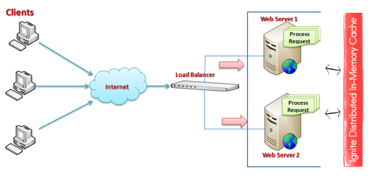

Speed up your ASP.NET web farm with a Apache Ignite distributed caching.



# Rationale

ASP.NET performance can be improved in a number of ways, including:

* Cache rendered pages with [Output Cache](https://msdn.microsoft.com/en-us/library/ms178597.aspx).
* Scale out by setting up a [Web Farm](https://technet.microsoft.com/en-us/library/jj129543(v=ws.11).aspx) so that multiple servers handle the requests.

What if we want to combine these approaches? Using default output caching mechanism in a web farm means a separate cache on each server.
So if the load balancer sends a main page request to server 1, and next main page request to server 2, the cache is not used.
If there are N servers, output cache is N times less effective.

Distributed cache solves this issue and provides other benefits:

* All cached data is shared between servers. No matter which server is chosen by the load balancer, it will hit the cache if there is an entry.
* Data is not lost when the worker process recycles.
* RAM from all servers is combined to allow more data to be cached.

Let's see how to set up ASP.NET Output Caching with Apache Ignite.

# Test Project

We are going to use [Contoso University](https://code.msdn.microsoft.com/ASPNET-MVC-Application-b01a9fe8)
sample project from Microsoft which is an ASP.NET MVC 5 application with multiple pages.

* Download the project: [https://code.msdn.microsoft.com/ASPNET-MVC-Application-b01a9fe8](https://code.msdn.microsoft.com/ASPNET-MVC-Application-b01a9fe8).
* Unpack, open in Visual Studio, build and run. Verify that the app works as expected.

# Setting Up Output Caching

Enabling output caching is as simple as marking your controller action with the `[OutputCache]` attribute:

* Navigate to `HomeController` class.
* Enable caching with five second expiration for the home page:

```cs
[OutputCache(Duration = 5)]
public ActionResult Index()
{
    return View();
}
```

To verify that caching does work, add `DateTime` output to the home page title:

```html
<h1>Contoso University @DateTime.Now.TimeOfDay</h1>
```

Now if you reload the page repeatedly, the time will only change once in 5 seconds.

We have configured default output caching mechanism. If you deploy our web application to two servers and view the home page from both of them side by side,
displayed time will never be the same, since each server maintains a separate cache.

# Configuring Apache Ignite.NET Output Cache Provider

* Install Ignite ASP.NET provider via NuGet: `Install-Package Apache.Ignite.AspNet`
* Import Ignite configuration section by adding the following to `<configSections>` in the `web.config`:

```xml
<section name="igniteConfiguration" type="Apache.Ignite.Core.IgniteConfigurationSection, Apache.Ignite.Core" />
```

* Configure default Ignite instance:

```xml
<igniteConfiguration />
```

* Configure default caching provider by adding the following to the `system.web`:

```xml
<caching>
    <outputCache defaultProvider="apacheIgnite">
        <providers>
            <add name="apacheIgnite" type="Apache.Ignite.AspNet.IgniteOutputCacheProvider, Apache.Ignite.AspNet"
                 igniteConfigurationSectionName="igniteConfiguration" />
        </providers>
    </outputCache>
</caching>
```