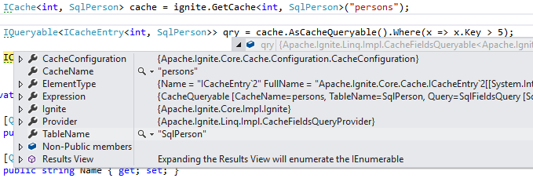

LINQ has many benefits over SQL, but at what cost?

# Benchmark Results

Let's get straight to the results!

```
            Method |      Median |     StdDev |
------------------ |------------ |----------- |
 QueryLinqCompiled |  30.7881 us |  1.5442 us |
          QuerySql |  32.5247 us |  1.5956 us |
         QueryLinq | 151.9118 us | 13.7912 us |
```

Code is at [github.com/ptupitsyn/IgniteNetBenchmarks](https://github.com/ptupitsyn/IgniteNetBenchmarks/blob/master/IgniteLinqBenchmark.cs).

This is a comparison of equivalent queries via SQL, LINQ and Compiled LINQ.
Query is very simple (`select Name from SqlPerson where (SqlPerson.Id < ?)`), data set is very small (40 items, 20 returned): this exposes LINQ overhead better.

We can see right away that LINQ is a lot slower than raw SQL, but compiled LINQ is a tiny bit faster.
Note that results are in *micro*seconds: real-world queries may take tens or even hundreds of *milli*seconds, so LINQ overhead will be hardly noticeable.

Anyway, how can we explain these results? Why compiled LINQ is faster than raw SQL?

# How Ignite LINQ Works

```cs
ICache<int, SqlPerson> cache = ignite.GetCache<int, SqlPerson>("persons");

IQueryable<ICacheEntry<int, SqlPerson>> qry = cache.AsCacheQueryable().Where(x => x.Key > 5);

ICacheEntry<int, SqlPerson>[] res = qry.ToArray();
```

If we run the above code in Visual Studio debugger and look at `qry` variable, we'll see something like this:



Compiler has translated `.Where(x => x.Key > 5)` to an Expression Tree and passed it to `CacheFieldsQueryProvider`,
which, as we can see, turns into a regular Ignite.NET `SqlFieldsQuery`. This process is not free, that's where the overhead comes from.

We can get that `SqlFieldsQuery` and run it manually:

```cs
TODO
```

TODO: However, LINQ results in [generic result], and `QuerySqlFields` gives us `IQueryCursor<IList>` TODO