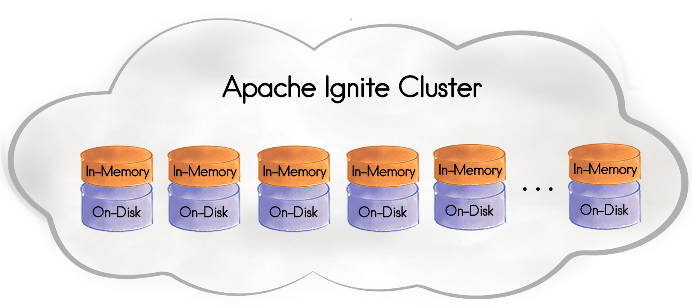

Apache Ignite 2.1 [has been released](https://blogs.apache.org/ignite/entry/apache-ignite-2-1-a) today, introducing Ignite Persistent Store!
Another huge step forward for the project: it becomes a real database with unique feature set, check out the comparison table on [ignite.apache.org frontpage](https://ignite.apache.org/). As usual, we'll have a look at new features from .NET standpoint.




# Ignite Persistent Store

Ignite has been an in-memory system from the start: RAM is fast, disk is slow, we all know that.
However, in most use cases we still want to persist data in some non-volatile storage, in case of full cluster restart, data center failures, and the like.
Most common solution is an RDBMS serving as [cache store](https://apacheignite-net.readme.io/docs/persistent-store), which has a lot of downsides (poor performance, single point of failure, complexity of the overall solution).

Ignite 2.1 solves all these problems with a single line of configuration, which enables efficient automatic persistence of all cached data on disk.
The following code demonstrates how cache data survives cluster restart (just run it repeatedly):

```cs
var cfg = new IgniteConfiguration 
{ 
    PersistentStoreConfiguration = new PersistentStoreConfiguration() 
};
using (var ignite = Ignition.Start(cfg))
{
    ignite.SetActive(true);  // Required with enabled persistence.
    var cache = ignite.GetOrCreateCache<Guid, string>("myCache");
    cache[Guid.NewGuid()] = "Hello, world!";
    Console.WriteLine("\nCache size: " + cache.GetSize());
}
```

Have you ever seen a database that is so simple to use? I haven't.
There is a single NuGet package behind this code, nothing else. And you can run SQL, LINQ and full-text queries over arbitrary data.

By default everything is stored in Ignite work directory, which happens to be in system Temp folder, so you may want to change this (call `IIgnite.GetConfiguration().WorkDirectory` to see where is it on your machine).

Every Ignite node persists only a part of data which is primary or backup for that node, so storage space and IO load are split between all machines (in contrast with RDBMS cache store).

See more details in [documentation](https://apacheignite.readme.io/docs/distributed-persistent-store); working [example](https://github.com/apache/ignite/blob/master/modules/platforms/dotnet/examples/Apache.Ignite.Examples/Datagrid/StoreExample.cs) can be found in full [binary or source distribution](https://ignite.apache.org/download.cgi).


# Automatic Remote Assembly Loading 

Ignite Compute jobs involve executing user code on remote machines (for example, `ICompute.Broadcast` will execute provided action on every node in cluster).
Before 2.1 we had to make sure that required assemblies (dll and exe files) are loaded on all cluster nodes. With nodes started from `Apache.Ignite.exe` we had to use `-assembly` switch manually.

Ignite 2.1 automates this process: when compute job arrives on some node and Ignite fails to locate an assembly with required types locally, it will request that assembly from other nodes in cluster. This feature has to be enabled explicitly:

```cs
var cfg = new IgniteConfiguration
{
    PeerAssemblyLoadingMode = PeerAssemblyLoadingMode.CurrentAppDomain
}
```

Besides making the deployment simpler, this feature enables a whole set of new use cases where the cluster keeps running and client nodes perform computations:
* Perform one-time computations (e.g. engineers use the cluster to speed up some work)
* Test new and updated computations (quick turnaround)
* Gather information from remote machines (e.g. some logs, system details)
* Dynamically deploy [services](https://apacheignite-net.readme.io/docs/service-grid)

Ignite uses assembly-qualified type names for compute jobs, which includes assembly version, so you can change existing compute job implementation and Ignite will pick it up. Assembly version autoincrement (`[assembly: AssemblyVersion("1.0.*")]`) can simplify the process.

More details can be found in documentation: [apacheignite-net.readme.io/docs/zero-deployment](https://apacheignite-net.readme.io/docs/zero-deployment).

## Assembly Loading & LINQPad

LINQPad is great for testing things quickly (see [Using Apache Ignite.NET in LINQPad](https://ptupitsyn.github.io/Using-Apache-Ignite-Net-in-LINQPad/)), and automatic assembly loading works perfectly there.

You can start a bunch of `Apache.Ignite.exe` processes, then play around with `ICompute` in LINQPad: it produces an assembly with unique name on each run, so you don't need to worry about versions. Try this:
* Install Ignite.NET somewhere (see NuGet Deployemnt below) and modify `Apache.Ignite.exe.config`: `<igniteConfiguration peerAssemblyLoadingMode="CurrentAppDomain" />`
* Run `Apache.Ignite.exe` a couple of times
* Run LINQPad, install Ignite NuGet package
* Switch to "C# Program" and paste the code:

```cs
void Main()
{
	var cfg = new IgniteConfiguration 
	{ 
		PeerAssemblyLoadingMode = PeerAssemblyLoadingMode.CurrentAppDomain,
		ClientMode = true
	};
	using (var ignite = Ignition.Start(cfg))
	{
		ignite.GetCompute().Broadcast(new MyAction());
	}
}

class MyAction : IComputeAction
{
	public void Invoke() => Console.WriteLine("Hello, World!");
}
```

Run the program and observe "Hello, World!" output on all server nodes.
Change the text and run again: new code is picked up by Ignite!


# Standalone NuGet Deployment

Ignite nodes can be started from code (`Ignition.Start()`) or with a standalone executable (`Apache.Ignite.exe`). However, standalone executable was only available as a part of [full binary distribution](https://ignite.apache.org/download.cgi).

2.1 fixes this discrepancy and includes standalone executable in [Apache.Ignite NuGet package](https://www.nuget.org/packages/Apache.Ignite/) so you can easily install and run Ignite with command line:

```shell
# Powershell
wget https://dist.nuget.org/win-x86-commandline/latest/nuget.exe -OutFile nuget.exe
nuget install Apache.Ignite
.\Apache.Ignite.*\lib\net40\Apache.Ignite.exe
```


# LINQ Improvements

SQL DML (Data Modification Language) has been introduced in [Ignite 1.9](https://ptupitsyn.github.io/Whats-New-In-Ignite-Net-1-9/), and LINQ starts to catch up.

**Conditional data removal** (SQL `DELETE FROM ... WHERE ...`) is now possible:

```cs
var cache = ignite.GetCache<int, Deal>("deals").AsCacheQueryable();

cache.Where(p => p.Value.Company == "Foo").RemoveAll();
```

This is more optimal than loading relevant entries and removing them afterwards. Batch updates via `UpdateAll` are on the way in future versions.

**Local collection joins** provide efficient alternative to `Contains` and other similar cases. For example, search by multiple field values can be done like this:

```cs
int[] companies = new[] { "Foo", "Bar", "Baz" };

var entries = cache.Join(companies, entry => entry.Value.Company, name => name, (entry, name) => entry);
```

Which generates a temporary table join:

```sql
select _T0._KEY, _T0._VAL from "deals".Deal as _T0 inner join table (F0 nvarchar = ?) _T1 on (_T1.F0 = _T0.COMPANY)
```

As you can see, this query is parametrised with a single `?`, so varying number of elements in local array does not affect cached query plan.

# Conclusion
## TODO

From small hoppy projects to huge enterprise deployments. Starts lightweight and grows.
Swiss Army Knife: easy storage, caching, concurrency, interprocess/network communication, serialization, anything you want.
Embedded DB, SQL CE.