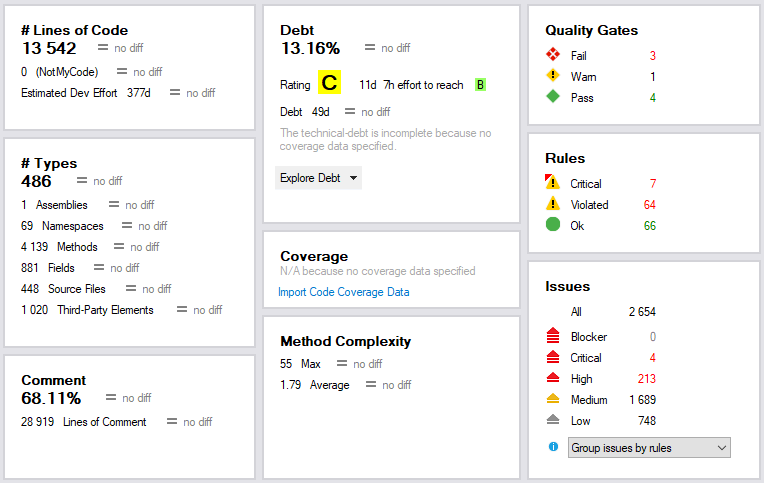
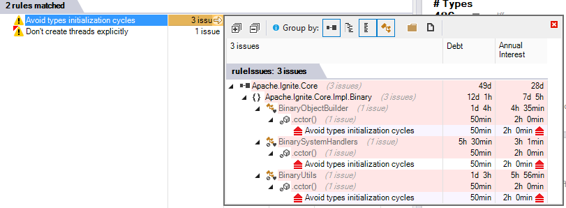

Along with unit testing, continuous integration, and code review, static code analysis is invaluable for maintaining healthy code base.

[Ignite.NET](https://github.com/apache/ignite/tree/master/modules/platforms/dotnet) uses [FxCop](https://en.wikipedia.org/wiki/FxCop) and [ReSharper](https://www.jetbrains.com/resharper/) code analysis from early days, and this process is included in continuous integration on [Ignite TeamCity](https://ci.ignite.apache.org/viewType.html?buildTypeId=Ignite20Tests_IgnitePlatformNetInspections), so I was fairly confident that our code is (mostly) fine.

Not so long ago [Patrick Smacchia](https://blog.ndepend.com/author/psmacchia/) reached out to me and suggested to try [NDepend](http://www.ndepend.com/) as well. Let's see how it works out!

# Getting Started with NDepend

We are going to work only with `Apache.Ignite.Core` project: it is the biggest, most important, and most complicated part of Ignite.NET.

NDepend, like FxCop, operates on a built assembly (dll file), so we have to build the project in Visual Studio, 
open up the assembly in `VisualNDepend.exe`, and hit F5 (Run Analysis). The process is surprisingly quick: 1 second on my machine,
where ReSharper (command-line) and FxCop take several seconds.

Upon analysis completion we are presented with some statistics and a summary of issues:

2654 issues! Whoops! No blockers at least.
But every static analyzer produces false positives and irrelevant issues, so it's not time to worry, yet.

# Exploring Code Issues

There are 4 critical issues and 7 critical rule violations, we are going to start with these.
Click on red `4` number to reveal a list of issues:

## [Avoid types initialization cycles](http://www.ndepend.com/default-rules/Q_Avoid_types_initialization_cycles.html) (3 issues)

Hovering over the **"Avoid types initialization cycles"** rule name shows a pop-up window with [detailed rule description](http://www.ndepend.com/default-rules/Q_Avoid_types_initialization_cycles.html) along with possible false positive scenarios.

Our case seems like a false positive, since [BinaryObjectBuilder](https://github.com/apache/ignite/blob/82e5f8a6553323e793c01c54e24dda6d47188ce6/modules/platforms/dotnet/Apache.Ignite.Core/Impl/Binary/BinaryObjectBuilder.cs) does not have a static constructor and does not use [BinarySystemHandlers](https://github.com/apache/ignite/blob/82e5f8a6553323e793c01c54e24dda6d47188ce6/modules/platforms/dotnet/Apache.Ignite.Core/Impl/Binary/BinarySystemHandlers.cs) in static field initializers.

The only usage of `BinarySystemHandlers` is on [Line 127](https://github.com/apache/ignite/blob/82e5f8a6553323e793c01c54e24dda6d47188ce6/modules/platforms/dotnet/Apache.Ignite.Core/Impl/Binary/BinaryObjectBuilder.cs#L127), but this has nothing to do with type initialization.

However, looking closer at how these three classes (`BinaryUtils`, `BinaryObjectBuilder`, `BinarySystemHandlers`) relate, reveals a real code quality issue: method `GetTypeId` does not really belong in `BinarySystemHandlers`, it operates only on some constants from `BinaryUtils`. So we could move `GetTypeId` to `BinaryUtils`, but that class is already ugly ("utility class anti-pattern"). Proper solution is to extract type code handling logic to a separate class: [IGNITE-6233](https://issues.apache.org/jira/browse/IGNITE-6233). So even a false positive turned out to be quite useful.

## [Don't create threads explicitly](https://www.ndepend.com/default-rules/Q_Don't_create_threads_explicitly.html) (1 issue)

This issue is simpler, `new Thread(Run).Start()` should be replaced with a `ThreadPool` or `Task`: [IGNITE-6231](https://issues.apache.org/jira/browse/IGNITE-6231). Exception handling is also missing in that thread, which can potentially bring down entire process.

Moving on to `High` issues.

## [Avoid namespaces mutually dependent](https://www.ndepend.com/Default-Rules/Q_Avoid_namespaces_mutually_dependent.html) (89 issues)

The most violated `High` rule. It tells us that low-level namespaces (such as `Apache.Ignite.Core.Impl.Binary`) should not use higher-level namespaces (`Apache.Ignite.Core`). Following this rule provides a proper layered architecture where each namespace is kinda "thing in itself", which can be moved anywhere, extracted to external assembly, etc. This makes refactoring easier.

Such decoupling can be achieved by introducing additional interfaces. In real world, however, introducing an interface just for the sake of decoupling within single assembly is not feasible. Most of the core Ignite functionality is quite tightly coupled and is not expected to exist separately.

Good example of this is [serialization engine](https://ptupitsyn.github.io/Ignite-Serialization-Performance/): it is inseparable from Ignite, because it exchanges type metadata with other nodes separately.

This rule is still useful for baseline comparisons.

## [P/Invokes should be static and not be publicly visible](https://www.ndepend.com/default-rules/Q_P_Invokes_should_be_static_and_not_be_publicly_visible.html) (21 issues)

`IgniteJniNativeMethods` class is `internal static`, so this looks like a false positive to me.

## [A field must not be assigned from outside its parent hierarchy types](https://www.ndepend.com/default-rules/Q_A_field_must_not_be_assigned_from_outside_its_parent_hierarchy_types.html) (17 issues)

This is a very good rule, and [Ignite.NET coding guidelines](https://cwiki.apache.org/confluence/display/IGNITE/Ignite.NET+Development) go even further by disallowing non-public fields entirely.

There are a couple of exceptions: `UnmanagedCallbackHandlers` is used solely for unmanaged interop; `BinaryReader.Frame` and `BinaryWriter.Frame` are private structs and are performance-sensitive.

## [Override equals and operator equals on value types](https://www.ndepend.com/Default-Rules/Q_Override_equals_and_operator_equals_on_value_types.html) (15 issues), [Structures should be immutable](https://www.ndepend.com/default-rules/Q_Structures_should_be_immutable.html) (7 issues)

Again, very good rules. All public structs must follow it. Found issues are related to private structs, which have clearly defined use cases and are not used in comparisons and data structures.

## [Base class should not use derivatives](https://www.ndepend.com/default-rules/Q_Base_class_should_not_use_derivatives.html) (3 issues)

[Open/closed principle](https://en.wikipedia.org/wiki/Open/closed_principle) in action. 2 public classes violate this rule: `TcpDiscoveryIpFinderBase` and `EvictionPolicyBase`. These classes are explicitly closed for modification from outside of the assembly, constructors are internal. Only predefined derivatives are supported by the API.

## [Property getters should be immutable](https://www.ndepend.com/Default-Rules/Q_Property_Getters_should_be_immutable.html) (2 issues)

Relates to [Choosing Between Properties and Methods](https://msdn.microsoft.com/en-us/library/ms229054.aspx) MSDN guidelines. Main exception here is lazy initialization (`TransactionsImpl.Current`). The other issue is `ClusterGroupImpl.TopologyVersion`, which performs expensive `RefreshNodes()` nodes operation and should really be a method: [IGNITE-6370](https://issues.apache.org/jira/browse/IGNITE-6370).

# Conclusion

We have explored a small part of issues found by NDepend, and already filed 3 tickets. The rule set is incredibly rich and covers many guidelines and best practices. I can recommend the tool for project of any size.

As for Ignite.NET, we have decided to [integrate NDepend](https://issues.apache.org/jira/browse/IGNITE-6382) with our CI pipeline: there is excellent [TeamCity support](https://www.ndepend.com/docs/teamcity-integration-ndepend).