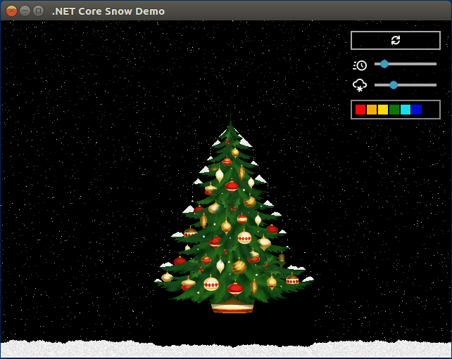

Cross-platform .NET is all the rage now. You can do console apps in C# and F#, 
web with ASP.NET Core, mobile with Xamarin. But can you do desktop UI apps?

# Enter Avalonia

.NET Core by itself does not provide any UI framework, and Microsoft does not seem to bother with this.
They are mostly trying to appeal to web developers, and this is understandable: web apps are much more popular.

With Mono you could at least use Windows Forms, but Mono is old stuff.

Turns out there is [Avalonia UI](https://github.com/AvaloniaUI/Avalonia) project, and it is pretty decent!
* WPF-inspired, so existing XAML experience translates easily (though there are some [differencies](http://avaloniaui.net/tutorial/from-wpf.html))
* Supports .NET Core
* Works on Windows, Linux, macOS, and even Android/iOS with Mono

So I've decided to try it out. And to make things interesting, let's do an old-school DOS demoscene inspired falling snow effect!

# Getting Started

First, install [Visual Studio Extension](https://marketplace.visualstudio.com/items?itemName=AvaloniaTeam.AvaloniaforVisualStudio).
Create a project with the installed project template. It is a bit outdated, so we'll have to change 
`<TargetFrameworks>netcoreapp1.1;net461</TargetFrameworks>` to `<TargetFramework>netcoreapp2.0</TargetFramework>` in the csproj file.

We are presented with regular WPF files: `App.xaml`, `MainWindow.xaml`, and their code-behind.
XAML Designer did not work for me, but who uses it, anyway?  

---
This article in Russian: [Кроссплатформенная новогодняя демка на .NET Core и Avalonia](https://habrahabr.ru/post/345708/)