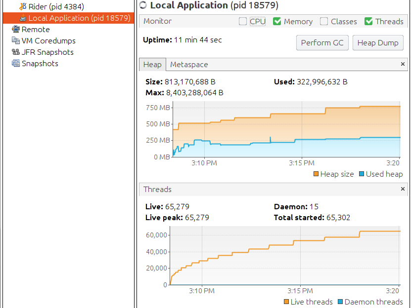
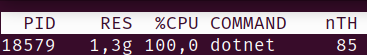

[Ignite.NET](https://ignite.apache.org) runs in-process JVM (in thick mode) and interacts with it using [JNI](https://en.wikipedia.org/wiki/Java_Native_Interface). Since version 2.4, when Ignite.NET became cross-platform, we had a stealthy and mysterious bug: JVM thread count kept growing, consuming memory, even though actual OS thread count for the process was low.


# The Reproducer

The reproducer from one of our users boiled down to this:

```cs
var ignite = Ignition.Start(nodeConfig);

var cache = ignite.GetOrCreateCache<int, int>("Test");
cache[1] = 1;

while (true)
{
	var thread = new Thread(_ => cache.Get(1));
	thread.Start();
	thread.Join();
}
```

When you run this on Ignite.NET version 2.4 .. 2.7.6, the following happens:



[VisualVm](https://visualvm.github.io/) shows `65279` Java threads. 



[Top](https://linux.die.net/man/1/top) shows `85` OS threads.

Memory consumption is not that bad here, but creating new threads becomes slower and slower: here we see 65K threads created in 11 minutes, while after the bugfix the same program can start/stop 65K threads in 30 seconds.

Java uses native threads, there is no green thread magic here. So what is going on? How is that possible?

Note that manual thread management is a rarity in modern .NET, most people use `ThreadPool` directly or via `Task` APIs, which makes this bug stealthy - threads rarely start and stop. So this issue took a while to surface.


# JNI and Threads

As mentioned above, Ignite.NET interacts with in-process JVM via JNI. The basic procedure [looks like this](https://docs.oracle.com/javase/8/docs/technotes/guides/jni/spec/invocation.html):

```cs
JNI_CreateJavaVM();
// Call Java methods
DestroyJavaVM();
```

However, this only works in one thread, [quote](https://docs.oracle.com/javase/8/docs/technotes/guides/jni/spec/invocation.html):

```
The JNI interface pointer (JNIEnv) is valid only in the current thread. Should another thread need to access the Java VM, it must first call AttachCurrentThread() to attach itself to the VM and obtain a JNI interface pointer. Once attached to the VM, a native thread works just like an ordinary Java thread running inside a native method. The native thread remains attached to the VM until it calls DetachCurrentThread() to detach itself.
```

Already see where this is going?

Ignite starts the JVM once, and almost all APIs are thread-safe. You can (and should) use one Ignite instance from many threads. So, under the covers, Ignite calls `AttachCurrentThread` whenever a Java call is involved. But we don't call `DetachCurrentThread` right away, for performance reasons.


Attach/Detach call pair takes around **50μs** (microseconds) on my machine. This may not seem like much, but it is actually very significant. One of our standard `ICache.Get` benchmarks shows **160K op/s** without `DetachCurrentThread`, and only **16K op/s** with `DetachCurrentThread` - 10 times slower.

So Ignite does not call `DetachCurrentThread` right away. We do it only on thread exit. I mean, *we thought we do*. Before 2.4, Ignite .NET reused some code from Ignite C++: all the JNI stuff was encapsulated there. It was Windows-only, and we handled `DLL_THREAD_DETACH` in [DllMain](https://docs.microsoft.com/en-us/windows/win32/dlls/dllmain) to call `DetachCurrentThread` in JNI - an obvious solution.

This was forgotten during the migration to cross-platform, C#-only Ignite .NET 2.4


# Searching for the Fix

We've got rid of C++ layer in Ignite 2.4, and replaced it with direct P/Invoke calls to JNI APIs. It was great - breaking the shackles and becoming free from C++, Visual Studio, and Windows. The build became much simpler and faster. No more embedded DLLs. But with the DLL we have lost the `DLL_THREAD_DETACH`. And what about Linux and macOS - there is no such thing there anyway?

To summarize, our task is: **call `DetachCurrentThread` when a thread is about to exit**.

* Ignite APIs are called from user threads. We have no control here - no way to *insert our call at the end*.
* There is no built-in way in .NET to get a thread exit callback.
* We could create a class with a [finalizer](https://docs.microsoft.com/en-us/dotnet/csharp/programming-guide/classes-and-structs/destructors), call `Detach` from there, and put an instance of that class to a [ThreadLocal<T>](https://docs.microsoft.com/en-us/dotnet/api/system.threading.threadlocal-1?view=netframework-4.8): when a thread exits, GC will collect this instance  (maybe, sooner or later - there is no guarantee), and call our finalizer. The problem is - it is too late. `DetachCurrentThread` can not be called for a different thread, only for the current one. And our thread has already exited.
* We could provide an Ignite API for explicit thread cleanup, but this is really bad from usability standpoint.

This looked like a dead end to me for some time, but `ThreadLocal` turned out to be the right direction. Except that we had to use OS-specific thread locals instead of .NET native API.

* **POSIX (Linux/macOS)**: [pthread_key_create](https://linux.die.net/man/3/pthread_key_create) creates a thread local slot and takes a destructor pointer. The destructor is called on current thread at thread exit.
* **Windows**: [FlsAlloc](https://docs.microsoft.com/en-us/windows/win32/api/fibersapi/nf-fibersapi-flsalloc) creates a *fiber* local storage and takes a destructor pointer. The destructor is called on current thread at thread exit (and on fiber deletion, which is not relevant to us).

Both APIs are very similar. `destructor` has a signature of `void (*destructor)(void*)`. It is called only when a non-null value is stored in the corresponding storage, and that value is passed as the only argument.

This is perfect for us, just look at the signature: `jint DetachCurrentThread(JavaVM *vm)`. We can store `JavaVM` pointer in the thread local storage, and pass `DetachCurrentThread` function pointer as a destructor directly, on any OS! The whole solution looks like this for Linux:

```cs
[DllImport("libcoreclr.so")]
public static extern int pthread_key_create(IntPtr key, IntPtr destructor);

[DllImport("libcoreclr.so")]
public static extern int pthread_setspecific(int key, IntPtr value);

IntPtr _jvm;
int _tlsIndex;

void CreateJvm() 
{
	_jvm = JNI_CreateJavaVM(...);

	// Create storage once per JVM.
	int tlsIndex;
	pthread_key_create(new IntPtr(&tlsIndex), JNI_DetachCurrentThread);
	_tlsIndex = tlsIndex;
}

void AttachCurrentThread(IntPtr _jvm) 
{
	JNI_AttachCurrentThread(_jvm);

	// Store JVM pointer in thread local storage for current thread,
	// so it is passed to the destructor (JNI_DetachCurrentThread) on exit.
	pthread_setspecific(_tlsIndex, _jvm);
}

```

`DllImport`s are different on macOS and Windows, but the logic is very similar. Actual Ignite code is in [UnmanagedThread.cs](https://github.com/apache/ignite/blob/master/modules/platforms/dotnet/Apache.Ignite.Core/Impl/Unmanaged/UnmanagedThread.cs) and [Jvm.cs](https://github.com/apache/ignite/blob/master/modules/platforms/dotnet/Apache.Ignite.Core/Impl/Unmanaged/Jni/Jvm.cs).


# Conclusion

Situations where you need a *thread exit callback* seem to be quite rare, at least in C# / .NET world. I've found only [one  StackOverflow question](https://stackoverflow.com/questions/1163992/calling-a-method-when-thread-terminates/58226361#58226361) about this, and it is asked for a wrong reason anyway.

Interestingly enough, another distributed .NET database had a similar need: [RavenDB](https://ravendb.net/). See this blog post by their CEO, Oren Eini: [The design and implementation of a better ThreadLocal<T>](https://ayende.com/blog/189793-A/the-design-and-implementation-of-a-better-threadlocal-t) - I've left a comment there as well.

Since the problem of thread exit callback is quite generic and not specific to Ignite and JNI, I've created a NuGet package that encapsulates the solution: [UnmanagedThreadUtils](https://www.nuget.org/packages/UnmanagedThreadUtils/).