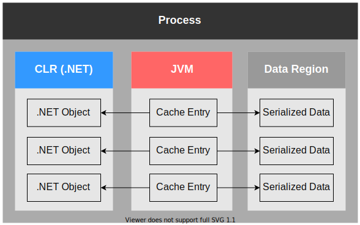

[Apache Ignite](https://ignite.apache.org/) 2.9 [has been released](http://apache-ignite-users.70518.x6.nabble.com/ANNOUNCE-Apache-Ignite-2-9-0-Released-td34311.html) a few days ago.
Let's have a look at .NET-specific features and improvements.  


# Platform Cache: It's All About Performance



```
|               Method |        Mean | Ratio | Allocated |
|--------------------- |------------:|------:|----------:|
|             CacheGet | 3,015.56 ns | 69.98 |    4176 B |
| CacheGetWithPlatform |    43.09 ns |  1.00 |      32 B |
```

**70 times faster**, not bad? The code is on GitHub: [PlatformCacheBenchmark.cs](https://github.com/ptupitsyn/IgniteNetBenchmarks/tree/master/PlatformCacheBenchmark.cs).

Now onto the details: Ignite keeps cache data in serialized form in memory regions or on disk (see [Memory Architecture](https://ignite.apache.org/docs/latest/memory-architecture)).
Therefore, even local read operations involve a JNI call, a copy from the memory region to the .NET memory, and a deserialization call.

[Platform Cache](https://ignite.apache.org/docs/latest/net-specific/net-platform-cache) is an additional layer of caching in the .NET memory which stores cache entries in deserialized form,
and avoids any overhead mentioned above. It is as fast as `ConcurrentDictionary`.
Additionally, allocations are greatly reduced (note `Allocated` column in all benchmark results on this page), so the GC has less work to do, increasing the performance further.

Naturally, there are tradeoffs: memory usage is increased, and cache write performance is affected. This feature is best suited for read-only or rarely changing data. 
Platform Cache can be used on client and server nodes, see [documentation](https://ignite.apache.org/docs/latest/net-specific/net-platform-cache) for more details.


### Scan Queries

[Scan Queries](https://ignite.apache.org/docs/latest/key-value-api/using-scan-queries) with filter also benefit from Platform Cache when it is enabled on server nodes:
only keys are passed to the .NET filter, reducing deserialization overhead. The effect is more noticeable with large values (~3KB per value in this case):

```
|                     Method |     Mean | Ratio | Allocated |
|--------------------------- |---------:|------:|----------:|
|             CacheQueryScan | 39.97 ms |  2.37 | 151.78 MB |
| CacheQueryScanWithPlatform | 16.85 ms |  1.00 |   2.52 MB |
```


### Map-Reduce With AffinityCall and ScanQuery

Let's say we want to iterate over the entire data set and perform some computations and aggregations.
In many cases SQL is the best way to do this, but not everything can be expressed in SQL.

A combination of Platform Cache, Scan Query and [Colocated Computations](https://ignite.apache.org/docs/latest/distributed-computing/collocated-computations) enables
an efficient approach to this task: when both `Local` and `Partition` properties are set on the `ScanQuery`, the results are served directly from Platform Cache, avoiding any network or JNI calls.

1. For every partition number, perform `ICompute.AffinityCall` - this ensures that partitions stay in place while we iterate over them
2. Inside the `IComputeFunc` use `new ScanQuery<K, V> { Local = true, Partition = p }`
3. Iterate over the `IQueryCursor`, filter the data and perform computations as needed

This way every node iterates over local deserialized data, memory allocation and serialization costs are minimized.
See the [benchmark code](https://github.com/ptupitsyn/IgniteNetBenchmarks/tree/master/PlatformCacheComputeBenchmark.cs) for a complete example. 

```
|                 Method |     Mean | Ratio | Allocated |
|----------------------- |---------:|------:|----------:|
|             ComputeSum | 63.79 ms |  6.01 |   74.9 MB |
| ComputeSumWithPlatform | 10.59 ms |  1.00 |   6.15 MB |
```


# Call .NET Services From Java: Full Circle of Services

.NET [services](https://ignite.apache.org/docs/latest/services/services) are now first-class citizens and can be called from anywhere: servers, thick and thin clients, Java or .NET.
And, in future, from other thin clients, like [Python](https://ignite.apache.org/docs/latest/thin-clients/python-thin-client) or 
[Javascript](https://ignite.apache.org/docs/latest/thin-clients/nodejs-thin-client) - the client protocol supports that.

Java thin client is the first thin client to support Service API (.NET thin services are coming in 2.10), so this will be the best demo!

**Start .NET server node and deploy the service**

```cs
class Program
{
    static void Main()
    {
        var ignite = Ignition.Start();
        ignite.GetServices().DeployClusterSingleton("MyService", new MyService());
        Thread.Sleep(-1); // Wait forever
    }
}

class MyService : IService
{
    // Empty Init/Execute/Cancel implementations omitted
    public string GetGreeting(string name) => 
        $"Hello {name} from {RuntimeInformation.FrameworkDescription}!";
}
``` 

**Start Java thin client and invoke the service**

```java
public class Main {
    public static void main(String[] args) {
        ClientConfiguration cfg = new ClientConfiguration().setAddresses("127.0.0.1:10800");
        IgniteClient client = Ignition.startClient(cfg);
        MyService service = client.services().serviceProxy("MyService", MyService.class);
        System.out.println(service.GetGreeting("Java " + System.getProperty("java.version")));
    }

    public interface MyService {
        @PlatformServiceMethod("GetGreeting")
        String greeting(String name);
    }
}
```

The output is something like `Hello Java 1.8.0_265 from .NET Core 3.1.9!`, depending on your setup.

Note how we use `@PlatformServiceMethod` to avoid Java naming guidelines violation:
without this annotation, we would have to change the method name to match C# code exactly.


# Thin Client Automatic Server Discovery

# Thin Client Compute

TODO: Java and .NET services!

# Other Improvements

* SqlFieldsQuery as ContinuousQuery.InitialQuery 
* FieldsQueryCursor metadata
* AffinityCall/AffinityRun with partition - mention this in Platform Cache section instead?
* Thin client cluster APIs - mention in server discovery?
* IgniteLock: Cache.Lock Replacement


# Wrap-up

TODO:
* Full release notes: https://ignite.apache.org/releases/2.9.0/release_notes.html
* New docs: https://ignite.apache.org/docs/latest/
