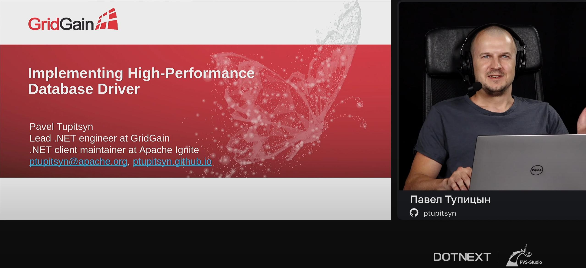

The recording of my DotNext 2022 Spring talk is now available. 

> Databases are the backbone of most applications. How do we talk to our database? How does the driver work, and how do you design and build a new one? This talk covers all the important steps: working with TCP sockets, message framing and serialization, failover, resource usage, and more. As a result, you will be able to build a driver for an existing database or design a protocol for a new one.

* Recording (🇬🇧 slides, 🇷🇺 voice, subtitles available): [youtube.com/watch?v=V-rwvPQZnUM](https://www.youtube.com/watch?v=V-rwvPQZnUM)
* Talk page (🇬🇧): [2022spring.dotnext.ru/en/talks/01c3bf11c61feb7affd9cbdb8ce5b7a3](https://2022spring.dotnext.ru/en/talks/01c3bf11c61feb7affd9cbdb8ce5b7a3/)
* Slides (🇬🇧): [pavel-tupitsyn-db-driver-dotnext2022.pdf](https://squidex.jugru.team/api/assets/srm/4348fdc0-3b4b-49a0-b877-4d9d20574bc4/pavel-tupitsyn-db-driver-dotnext2022.pdf)

